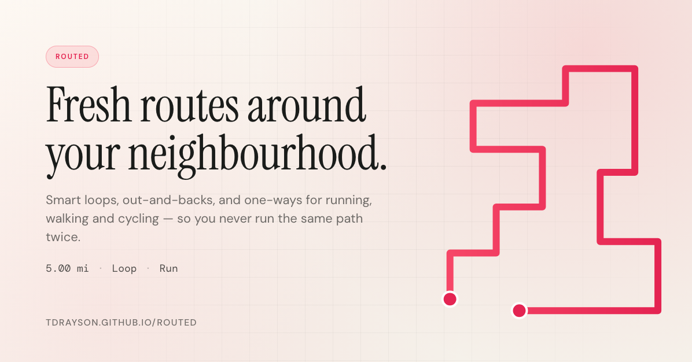

# Routed

Fresh routes around your neighbourhood, so you never run the same loop twice.

Routed generates smart running, walking and cycling routes from a start point and a target distance or time. Pick a loop, an out-and-back, or a one-way trip — it'll plan a path you haven't worn out yet, preview it on the map, and let you save, share, or export to GPX.

**Live:** <https://tdrayson.github.io/routed/>

## Features

- **Loops, out-and-backs and one-ways** for running, walking or cycling
- **Distance or time targets** in miles/kilometres or minutes/hours
- **Map-based picking** — drop start/end pins or use your current location
- **Ranked candidates** — generated routes are ordered by how closely they hit your target
- **Saved routes** — keep favourites in local storage, ready to re-open
- **Shareable links** — copy a titled URL that opens a single read-only view of the route
- **GPX export** and **Open in Google Maps**
- **Directional chevrons** along the route, with reverse chevrons on out-and-back trips
- **Light, responsive UI** — sidebar on desktop, stacked flow on mobile

## Licence

MIT — see [./LICENSE](./LICENSE).
